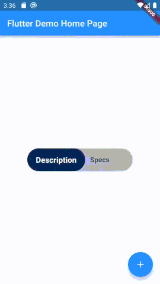

# Animated Toggle Widget

This is a widget that toggles between two values. They are `GestureDetector` which once pressed will update and call the `onToggleCallback` and the value change is an  `int` indicating the index of the button. This widget uses the screen's width size to scale the width, height, font size, and the padding and margins.

# Properties

* `required List<String> values` - This is a list of strings that will be the buttons text. Max is 2.
* `required ValueChange onToggleCallback` - A call back which will be called when the value of the `initialPosition` is changed and provides an `int` value indicating the index of the current selected button.
* `Color backgroundColor` - This is the background color of the toggle, this is initialized to `const Color(0xFFE7E7E8)`, but it can be changed to other colors.
* `Color buttonColor` - This is the button color of the toggle which is initialized to `const Color(0xFFFFFFFF)` which is **White.**
* `Color textColor` - The text color which is initialized to `const Color(0xFF000000)` which is **Black**.
* `double scaler` - This is the scale of the toggle widget compared to the screen and by effect the current size of the widget. This is initialized to `1` and it should be a float between `0-1` to scale down and `1-2` to scale up.

# How it looks

  

